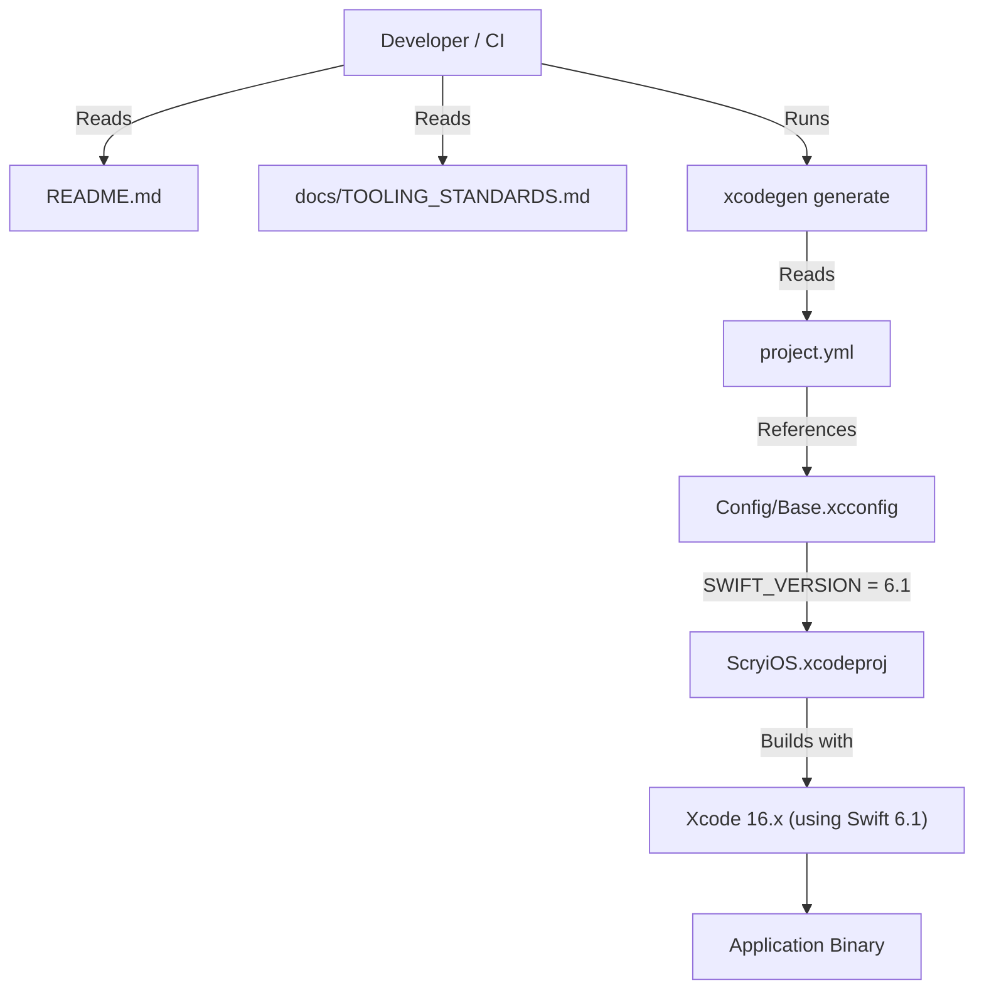

# Plan: Standardize and Update ScryiOS to Swift 6.1

## Chosen Approach (One‑liner)
Update the `SWIFT_VERSION` build setting in `Config/Base.xcconfig` to Swift 6.1, regenerate the project using XcodeGen, document this as the project standard, and validate compatibility with iOS 15.0+.

## Architecture Blueprint
This task primarily affects the project's build configuration and development environment, not its runtime architecture.

- **Modules / Packages Affected:**
  - `Config/Base.xcconfig`: Primary location for `SWIFT_VERSION` setting.
  - `project.yml`: XcodeGen project definition; must correctly inherit Swift version from xcconfig.
  - `ScryiOS.xcodeproj`: Generated artifact; changes will be reflected here.
  - `README.md`: Documentation of tooling requirements.
  - `docs/TOOLING_STANDARDS.md`: New document for formal tooling versioning.

- **Public Interfaces / Contracts:**
  - N/A: No changes to application public interfaces.

- **Data Flow Diagram (Build Process):**


- **Error & Edge‑Case Strategy:**
  - **Compile-time errors/warnings:** Address any issues flagged by the Swift 6.1 compiler. These are expected to be minor, relating to stricter type checking or syntax deprecations from Swift 5.0.
  - **Runtime behavior:** Basic smoke testing post-update to catch immediate regressions.
  - **Configuration Mismatch:** Build failure if `SWIFT_VERSION` is inconsistent or unsupported by the active Xcode.

## Detailed Build Steps

1. **Confirm Target Swift Version:**
   * Verify that Xcode 16.3 (developer's installed Xcode version) defaults to and fully supports Swift 6.1. This is the latest stable version appropriate for the specified Xcode baseline.

2. **Update Swift Version in Build Configuration:**
   * Open `Config/Base.xcconfig`.
   * Change the line `SWIFT_VERSION = 5.0` to `SWIFT_VERSION = 6.1`.
   * Add a comment above this line: `// Standard Swift version for the project. Aligned with Xcode 16.3+ (Swift 6.1). This is the single source-of-truth.`

3. **Verify XcodeGen Configuration:**
   * Inspect `project.yml`. Ensure no target or project-level setting explicitly overrides `SWIFT_VERSION` in a way that would prevent inheritance from `Config/Base.xcconfig`. Remove any such overrides if found.

4. **Regenerate Xcode Project:**
   * In the terminal, navigate to the project root directory.
   * Execute `xcodegen generate`. This updates `ScryiOS.xcodeproj` based on `project.yml` and the modified `.xcconfig` files.

5. **Verify Project Settings in Xcode:**
   * Open `ScryiOS.xcodeproj` in Xcode 16.3.
   * Select the `ScryiOS` project in the Project Navigator, then the `ScryiOS` target.
   * Navigate to the "Build Settings" tab.
   * Search for "Swift Language Version". Confirm the effective value is "Swift 6.1" (or displayed as "Swift 6" but reflecting the 6.1 setting from xcconfig).

6. **Clean and Build Project:**
   * Perform a clean build: "Product" > "Clean Build Folder" (or `Cmd+Shift+K`).
   * Build the project: "Product" > "Build" (or `Cmd+B`).

7. **Resolve Compilation Issues:**
   * Address any build errors or warnings arising from the Swift version update. Consult Swift 5.1-6.1 release notes if significant or unexpected issues occur.

8. **Validate Application Runtime:**
   * Run the application on an iOS 15.0+ simulator and, if possible, a physical device.
   * Perform basic smoke testing:
     * Ensure the app launches successfully.
     * Navigate to the main screen (`ContentView`).
     * Interact with primary UI elements (e.g., "Get Started" button).
     * Verify no immediate crashes or obvious visual/functional regressions.

9. **Document Swift Version Standard:**
   * Update `README.md`:
     * In the "Requirements" section, update: "Swift 6.1 (as bundled with Xcode 16.3+)".
   * Create `docs/TOOLING_STANDARDS.md` with the following content:
     ```markdown
     # Tooling Standards

     This document outlines the standard tooling versions for the ScryiOS project to ensure a consistent development environment, aligning with "Tooling and Environment" from DEVELOPMENT_PHILOSOPHY.md.

     ## Xcode

     - **Version:** 16.3 or later (as specified in `README.md` and to be enforced by an `.xcode-version` file in a subsequent task).
     - **Rationale:** Ensures compatibility with the specified Swift version and latest iOS SDK features.

     ## Swift

     - **Project Swift Version (MSRV):** 6.1
     - **Configuration File (Single Source of Truth):** `Config/Base.xcconfig` (setting: `SWIFT_VERSION = 6.1`)
     - **Rationale:** Aligns with the latest stable Swift version bundled with Xcode 16.3. This ensures the project leverages modern Swift features, benefits from compiler improvements, and maintains better security and compatibility.
     ```
   * Add `docs/TOOLING_STANDARDS.md` to Git.

10. **Commit Changes:**
    * Commit all modified files (`Config/Base.xcconfig`, `README.md`, `docs/TOOLING_STANDARDS.md`, any source files changed for compatibility) with a Conventional Commit message: `feat: update project to Swift 6.1 and standardize tooling docs`.

## Testing Strategy

- **Build Verification:** The primary test is a successful clean build using Xcode 16.3+ after the changes.
- **Manual Smoke Testing:** As outlined in "Detailed Build Steps" (Step 8) to confirm basic runtime integrity.
- **Automated Tests:** Existing unit/UI tests (if any) MUST pass. This task is a prerequisite for robust test target creation; currently, no automated tests are assumed to exist beyond build success.
- **What to mock:** No mocking is required for this task.
- **Coverage targets:** Not applicable for this configuration-focused task.

## Logging & Observability

- Compiler output (errors and warnings) during the build step serves as the primary diagnostic information for this change.
- No new application-level logging is introduced by this task.
- Existing `print()` statements are known technical debt ([Refactor] [PHILOSOPHY-CRITICAL]: Eradicate `print()` Statements) and are out of scope for this specific plan.

## Security & Config

- **Security Benefit:** Updating to Swift 6.1 incorporates compiler improvements and security patches inherent in newer Swift versions.
- **Configuration Management:** `SWIFT_VERSION` is managed in `Config/Base.xcconfig`, adhering to the philosophy of externalized build configuration.
- **Input Validation Hotspots:** N/A for this task.
- **Secrets Handling:** N/A for this task.
- **Least-Privilege Notes:** N/A for this task.

## Documentation

- **Code Self-Doc Patterns:**
  * A comment in `Config/Base.xcconfig` explains the `SWIFT_VERSION = 6.1` choice and its rationale.
- **README Updates:**
  * `README.md` updated to reflect Swift 6.1 in requirements.
- **New Documentation:**
  * `docs/TOOLING_STANDARDS.md` created to formally document Xcode and Swift versions, as per DEVELOPMENT_PHILOSOPHY.md ("Tooling and Environment" - MSRV MUST be defined).

## Risk Matrix

| Risk                                                                 | Severity | Mitigation                                                                                                                                                              |
|----------------------------------------------------------------------|----------|-------------------------------------------------------------------------------------------------------------------------------------------------------------------------|
| Source Code Incompatibility (Swift 5.0 -> 6.1)                       | medium   | Allocate time for code adjustments based on compiler errors/warnings. Swift's source compatibility is generally strong; expect minor fixes. Review Swift release notes.      |
| XcodeGen configuration issues (e.g., `SWIFT_VERSION` override)         | medium   | Verify `SWIFT_VERSION` in the generated `project.pbxproj` and target build settings after `xcodegen generate`. Correct `project.yml` or xcconfig includes if necessary. |
| Build failures due to incorrect Xcode/CI environment                 | high     | Clearly document Xcode 16.3+ requirement in `README.md` and `docs/TOOLING_STANDARDS.md`. Ensure CI environment uses the correct Xcode version. (Future: `.xcode-version` file) |
| Subtle App Behavior Regression (unlikely but possible)               | low      | Perform manual smoke testing as outlined. Future comprehensive automated tests will provide broader coverage.                                                              |
| Documentation (README, new standards doc) becomes stale or incorrect | medium   | Rigorous review of documentation changes. Establish a habit of updating tooling docs alongside tooling changes.                                                            |

## Open Questions

- Are there any known third-party dependencies (Swift Packages) with strict Swift version requirements that might conflict with Swift 6.1? (Initial assessment: unlikely for a minimal project, but worth a check if dependencies exist).
- Confirm CI environment(s) can support Xcode 16.3+ for building with Swift 6.1.